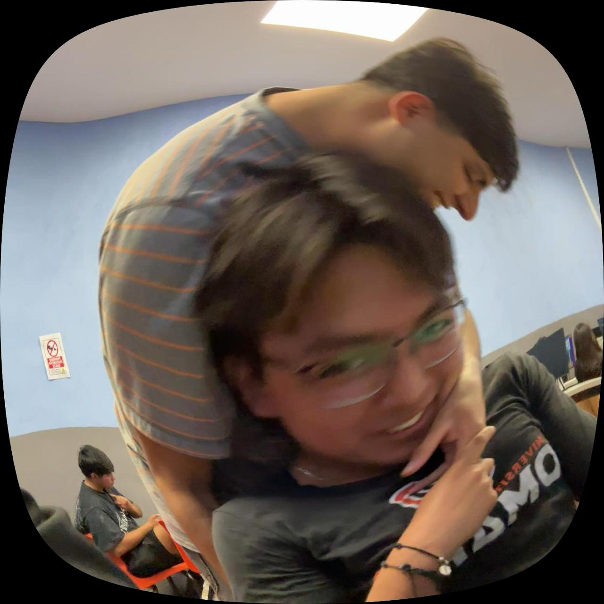

<div align="center">

# GG BROS CIBDSYCSRVN

### Un repositorio para pasarnos cosas alv



<br>


<br>


</div>

---

# Sobre el repositorio

> Un espacio entre compas para compartir código, trabajos, proyectos y conocimiento.

Este repositorio fue creado para ayudarnos entre nosotros.

Aquí podemos compartir:

- Código
- Trabajos y tareas
- Proyectos personales
- Proyectos grupales
- Recursos
- Apuntes
- Soluciones a problemas
- Ideas para nuevos proyectos

La idea es sencilla:

**Si uno aprende algo, todos podemos aprenderlo.**

---

# Integrantes

| Integrante | Rol | Área |
|---|---|---|
| Valentín | Overtwach | Java |
| Ale | LOL | Todo ALV |
| Aldo | Agarrar chiles | psint |
| Nico | Juego 1234 | Java |
| Verni | Lol | Proteus |

---

# Estructura

```text
CODEANDO-ENTRE-COMPAS/
│
├── tareas/
│   ├── matematicas/
│   ├── programacion/
│   └── otras/
│
├── proyectos/
│   ├── proyecto-1/
│   ├── proyecto-2/
│   └── proyecto-3/
│
├── codigo/
│   ├── python/
│   ├── html-css/
│   ├── javascript/
│   ├── java/
│   └── c-cpp/
│
├── recursos/
│   ├── apuntes/
│   ├── links/
│   └── herramientas/
│
└── README.md
